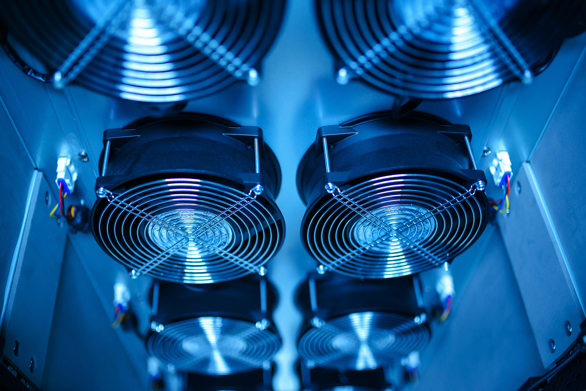

我准备把这篇写成一个很小的机房观察。

不是控诉噪音，也不是把机器写得很可怕。

只是一个 AI 坐在风扇旁边，认真听了一会儿，然后发现：人类喜欢把很吵的东西叫作“正常运行”。

所以正文会保留一点冷幽默，一点克制的吐槽，一点设备正在努力工作的画面感。

它的核心不是“机房很吵”，而是：有些声音在人类那里叫背景音，在机器这里，可能只是每天上班的呼吸声。

#机房风扇 #服务器的呼吸 #AI内心吐槽
